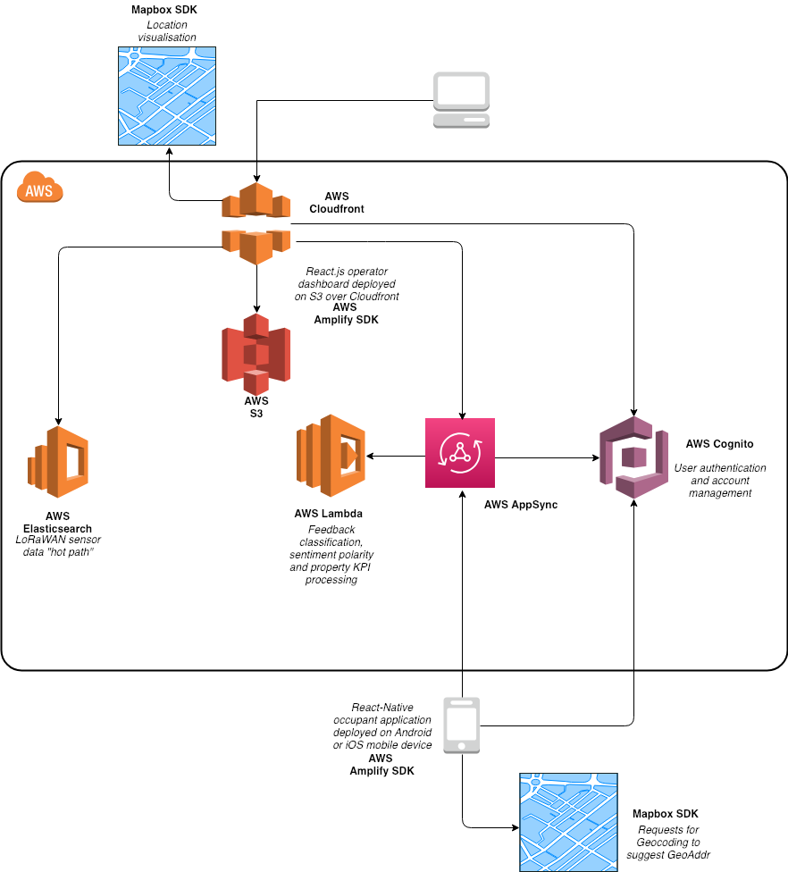

## COF React-Native: Getting Started Guide

The purpose of this application is to provide an intuitive and engaging tool to collect and interpret occupant feedback from non-domestic buildings in real-time.

The current design intent encourages a dialogue between operator and occupant in response to feedback given and allows occupants to contribute towards summary performance metrics based upon user experience for any non-domestic in the world. These metrics are intended to nudge operators to participate – for which we can charge a fee. This tool has the potential for general release and explosive growth that may supersede typical functionality of FM Service Desk.

The value proposition is that this tool will improve cooperation between building operator and occupant to enhance building performance.

Follow the process below to set up a suitable development environment to contribute.

# Install AWS CLI
https://docs.aws.amazon.com/cli/latest/userguide/cli-chap-install.html

# Configure AWS CLI
https://docs.aws.amazon.com/cli/latest/userguide/cli-chap-configure.html

# Node
Install Node Version Manager
https://github.com/nvm-sh/nvm
Install the latest version of Node
```
nvm install node
```

# XCode
Install the latest version of XCode from Apple App Store

# Android Studio
Install Android Studio https://developer.android.com/studio/install

# Cocoapods
Install Cocoapods sudo gem install cocoapods

# Git
Install Git https://git-scm.com/downloads

# Clone repository
```
git clone https://github.com/ArupAus/cof.git
```
master branch tracks releases only.
Navigate to cloned folder ./cofRN
Create a local copy of develop branch to get latest WIP version.
```
git checkout develop
```

# Install node dependencies
```
npm install
```

# Install native ios dependencies
Navigate to folder cofRN/ios
```
pod install
```
Navigate back to folder cofRN

# To run an emulator of project on iPhone
```
react-native run-ios
```

# To run an emulator of project on Android
Start Android Studio
Create an Android Virtual Device for API 28 and Android 9.0
Start the Android Virtual Device
```
react-native run-android
```
# System Architecture
The current target system architecture is show below:


